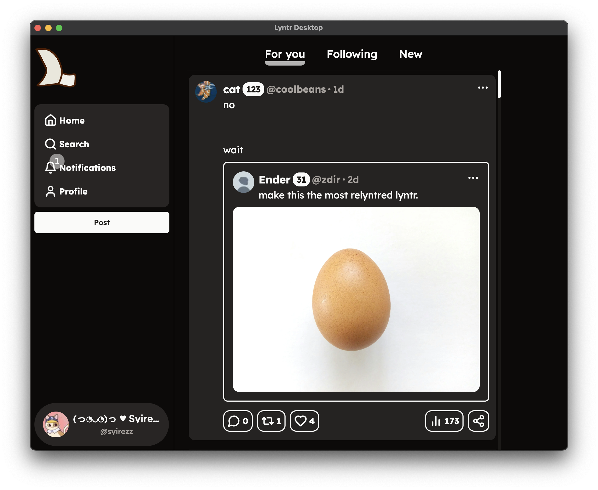

# Lyntr Desktop (Unofficial Client)
Lyntr Desktop - Based lyntr webClient for work on desktop as Linux, Windows, MacOS.

## Tested on:
- MacOs [Works!]
- Linux [NOT TESTED!] (Must work | if it work dm me @syirezz in discord)
- Windows [Works]

 


## Use already builded version
If you need vanilla don't put any args, if you need modded version put `--plus`

## Build

If you want build project step by this commands:

   Install:
   > electron@31.3.1

   > electron-builder@24.13.3

   > electron-squirrel-startup@1.0.1

   Then run:
   > npm run build 
   OR:
   >npm start

## How run modded verison?
For running modded version, you need install same as in build requirements:
   > electron@31.3.1

   > electron-builder@24.13.3

   > electron-squirrel-startup@1.0.1

Then run: 
```bash
npm start -- --plus
```


## Special thanks
@Syirezz[KailUser] - created Lyntr Desktop

@FaceDev[face-hh] - created Lyntr Website

@Sylicium[Sylicium] - created Lyntr+ (Used in modded client verison)
